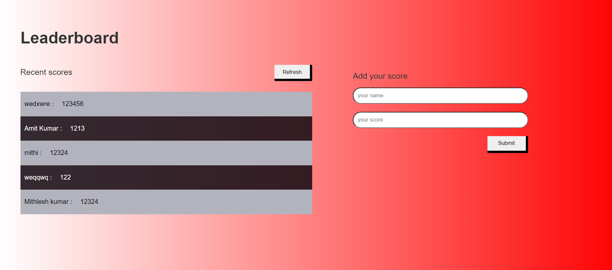

# Leaderboard
> Leaderboard website that displays scores submitted by different players. It also allows you to submit your score. All data is preserved thanks to the external Leaderboard API service.

### Additional description about the project and its features:
- Adding a new item.
- Removing a selected item.
- Marking a selected item as complete.
- Removing all items marked as complete at once.
- Reordering a selected item (as drag-and-drop) [as an additional feature].
- 
## Built With
- HTML, CSS
- Stylelint, Web Hint, Lighthouse
-Javascript
-Leaderboard API
## Live Demo
[Live Demo Link](https://mithi-code.github.io/leaderboard/dist)
## Getting Started
To get a local copy up and running, follow the steps in Setup below.
### Prerequisites
Basic knowledge of HTML, CSS, and JavaScript.
### Setup
If you installed git you can clone the code to your machine, or download a ZIP of all the files directly.
Command to clone the files to your machine:
```bash
git clone https://github.com/Mithi-code/leaderboard.git
```
- Once the files are on your machine, open the _todo-list_ folder in [Visual Studio Code](https://code.visualstudio.com/), and follow the steps in Installation & Set Up
## 🛠 Installation & Set Up
1. Install Node Modules
   ```sh
   npm install
   ```
2. Start the development server
   ```sh
   npm start
   ```
3. Open [http://localhost:8080](http://localhost:8080) to view it in the browser.
## 🚀 Building and Running for Production
1. Generate a full static production build
   ```sh
   npm run build
   ```
### Install
The following tools help make easier to work with sample code.
- [git](https://git-scm.com/downloads): A tool for managing source code
- [Visual Studio Code](https://code.visualstudio.com/): A source code editor
- [NVM](https://github.com/nvm-sh/nvm)
## Authors
👤 **Author1**
- GitHub: [@githubhandle](https://github.com/Mithi-code)
- Twitter: [@twitterhandle](https://twitter.com/LazyMithlesh)
- LinkedIn: [LinkedIn](https://www.linkedin.com/in/mithlesh-kumar-564a97221/)
## 🤝 Contributing
Contributions, issues, and feature requests are welcome!
Feel free to check the [issues page](https://github.com/Mithi-code/leaderboard/issues).
## Show your support
Give a ⭐️ if you like this project!
## 📝 License
This project is [MIT](./MIT.md) licensed.
